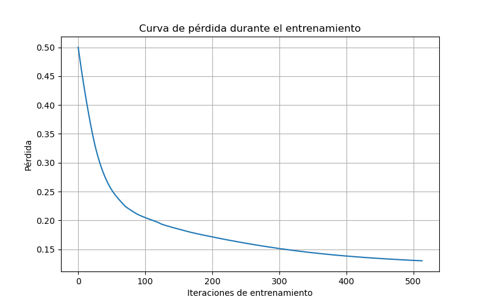

# Este es un repo para desarrollo de una red neuronal
Se hace una red neuronal para clasificar datos sinteticos.

Se ilustra el proceso con sickit learn y keras.

## Imagenes

aqui una imagen de muestra

